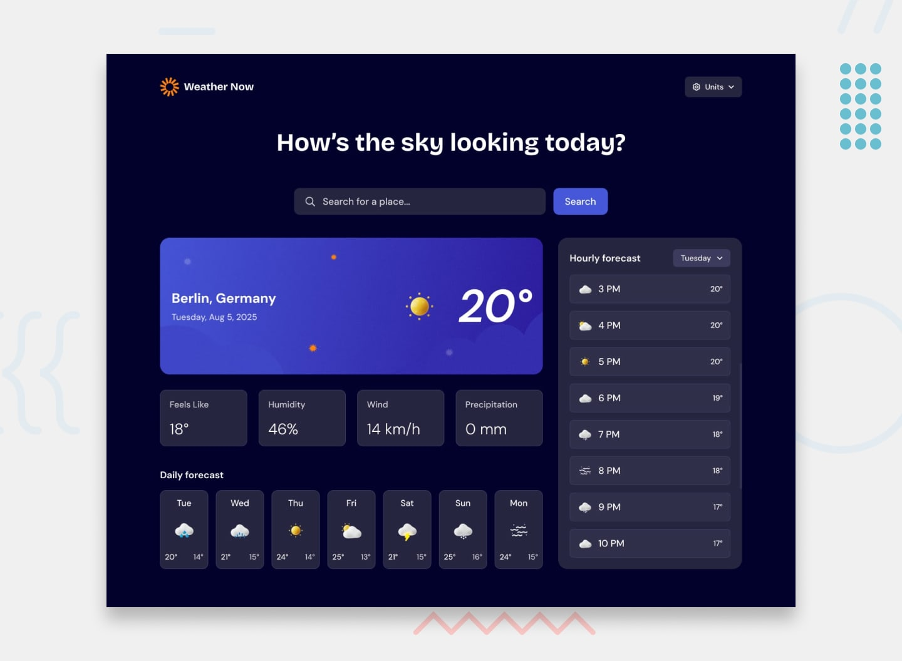

# Weather Now 🌤️



A modern, responsive weather application built with React that provides accurate weather forecasts with a beautiful user interface.

## 🌟 Features

- **Current Weather Display** - Real-time temperature, conditions, and weather details
- **Advanced Forecasting** - Hourly and 7-day weather predictions
- **Smart Location Detection** - Automatic geolocation with manual search fallback
- **Intelligent Search** - Type-ahead location search with dropdown results
- **Unit Flexibility** - Switch between Metric (°C, km/h) and Imperial (°F, mph) units
- **Responsive Design** - Optimized for desktop, tablet, and mobile devices
- **Error Handling** - Graceful handling of API errors and empty states
- **Loading States** - Professional skeleton screens during data loading

## 📁 Project Structure

```
src/
├── App.css                 # Main application styles
├── App.jsx                 # Main application component with routing logic
├── index.css               # Global styles and CSS imports
├── main.jsx                
├── assets/                 
├── Components/             # Reusable UI components
│   ├── CurrentWeather/     
│   ├── DailyForecast/      
│   ├── ErrorMessage/       
│   ├── Header/             
│   ├── HourlyForecast/     
│   ├── LoadingSkeleton/    
│   ├── LoadingSpinner/     
│   ├── NoResults/          
│   ├── SearchBar/          
│   ├── Title/              
│   └── WeatherDetails/     
├── content/                
│   └── weatherContent.jsx  # Weather content container
├── contexts/               # React Context providers
│   ├── UnitContext.jsx     # Unit preference management
│   └── WeatherContext.jsx  # Global weather state management
├── css/                    
│   ├── normalize.css       
│   ├── reset.css           
│   └── variables.css       
├── design/                 
├── hooks/                  
│   └── useDebounce.js      # Search debouncing utility
├── services/               
│   └── weatherAPI.js       # Weather API functions
└── utils/                  
    └── helpers.js          # Weather icon mapping and formatting
```

## 🔌 API Integration

### Weather Data - Open-Meteo API

The application integrates with the Open-Meteo API to fetch comprehensive weather data. The main fetch function handles current weather, hourly forecasts, and daily predictions with support for different unit systems.

```javascript
export const fetchWeatherData = async (latitude, longitude, unitParams = {}) => {
    try {
        const baseUrl = 'https://api.open-meteo.com/v1/forecast?';
        const params = new URLSearchParams({
            latitude: latitude.toString(),
            longitude: longitude.toString(),
            current: 'temperature_2m,apparent_temperature,relative_humidity_2m,weather_code,wind_speed_10m,precipitation,is_day',
            hourly: 'temperature_2m,relative_humidity_2m,apparent_temperature,precipitation_probability,weather_code,wind_speed_10m,',
            daily: 'weather_code,temperature_2m_max,temperature_2m_min,',
            timezone: 'auto',
            temperature_unit: unitParams.temperature || 'celsius',
            wind_speed_unit: unitParams.windSpeed || 'kmh',
            precipitation_unit: unitParams.precipitation || 'mm'
        });

        const url = `${baseUrl}${params.toString()}`;
        const response = await fetch(url);
        if (!response.ok) {
            throw new Error(`Weather API error! Status: ${response.status}`);
        }

        // Parse the JSON response
        const data = await response.json();
        return data;

    } catch (error) {
        throw new Error(`Failed to fetch weather data: ${error.message}`);
    }
};
```


## 🎨 Styling Approach

- **CSS Modules** for component-scoped styles
- **Design Tokens** for consistent spacing, colors, and typography
- **Responsive Grid** for adaptive layouts

### Additional API Functions:
- **Location Search**: Forward geocoding using Open-Meteo geocoding API
- **Reverse Geocoding**: City name lookup using Nominatim API for geolocation

## 🚀 Installation

### Prerequisites
- Node.js 16+
- npm or yarn

### Installation Steps

1. **Clone the repository**
   ```bash
   git clone <repository-url>
   cd weather-app
   ```

2. **Install dependencies**
   ```bash
   npm install
   ```

3. **Start development server**
   ```bash
   npm run dev
   ```


